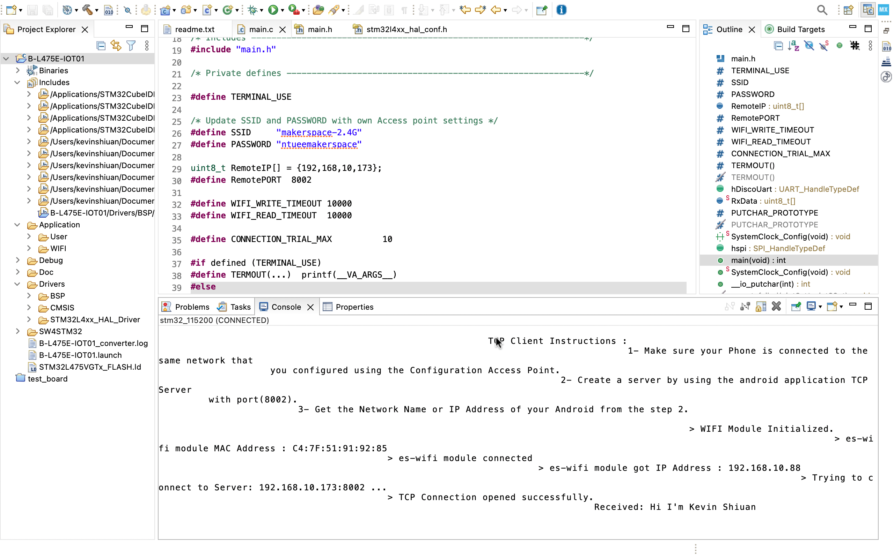
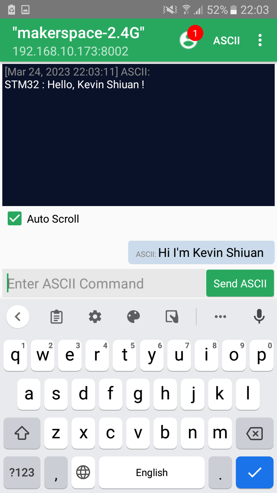

# embed-os-system-labs_Spring2023

This repo is used for teamwork submission for the HW2 of the course embed-os-system-labs in Spring 2023

---

# HW2 Socket Programming and Data Visualization

## for STM32CubeIDE

1.  ### open the project in STM32CubeIDE

    file -> open project from file systems -> choose the project folder

    ./HW2/STM32CubeL4/Projects/B-L475E-IOT01A/Applications/WiFi/WiFi_Client_Server/SW4STM32/B-L475E-IOT01

2.  ### modify project files

    i. at ./HW2/STM32CubeL4/Projects/B-L475E-IOT01A/Applications/WiFi/WiFi_Client_Server/Inc/main.h, add the following lines
```cpp
#include "stm32l475e_iot01_accelero.h"
#include "stm32l475e_iot01_qspi.h"
```

    ii. at ./HW2/STM32CubeL4/Projects/B-L475E-IOT01A/Applications/WiFi/WiFi_Client_Server/INC/stm32l4xx_hal_conf.h, uncomment line 62

```cpp
#define HAL_QSPI_MODULE_ENABLED
```
3.  ### edit main.c

    open ./Application/User/main.c, configure the wifi network name & password, IP address & port of the TCP server

```cpp
// WiFi network name and password
#define SSID_NAME "<your wifi name>"
#define SSID_PSWD "<your wifi password>"

// IP address and port of the TCP server
uint8_t RemoteIP[] = {192,168, xxx, yyy};
#define RemotePORT <port>
```

4. ### build and run

    build the project and run it on the board

5. ### set up the TCP server

    in our case, the TCP server is running on android phone, we installed an app called [TCP Server](https://play.google.com/store/apps/details?id=com.mightyIT.gops.tcpserver&hl=en&gl=US) on the phone and set the port to 8002, the app will show the IP address of the phone, which you should set as the IP address of the TCP server in the main.c file in step 3.

6. ### connect the board to the phone(TCP server)

    The board will try to connect to the TCP server. Status of the board will be shown on the serial monitor, which is **Command Shell Console** of STM32CubeIDE. the baud rate is *115200*.

7. ### communicate with the board

    Try to send a meaasage from TCP server to the board, the board will respond with the message `Hi`.

## Screenshots
STM32CubeIDE screenshot


phone screenshot



---

